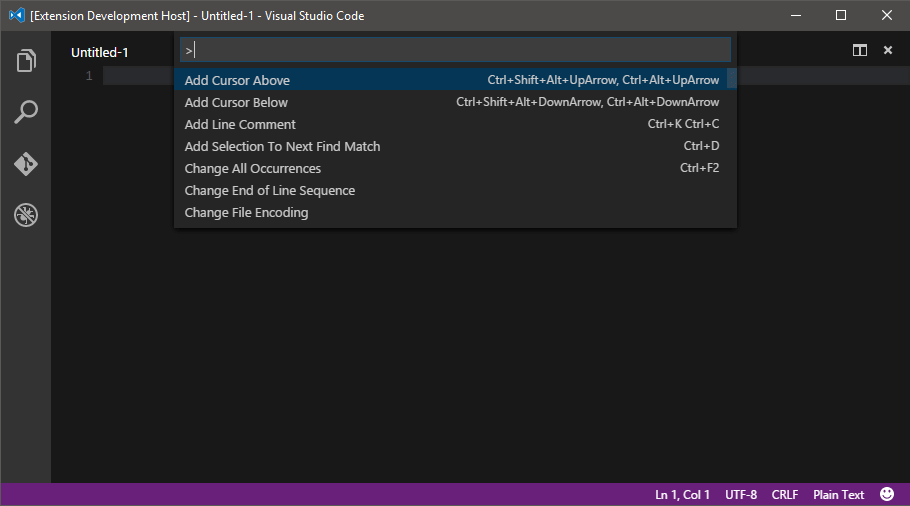

# Shell for VS Code

[][marketplace] [][gh-repo] [][issues] [][gitter]

## Description

Shell is a [VS Code][vscode] extension which lets you execute shell commands directly from the editor.

It helps you getting more productive by not having to leave the editor for running shell commands.

## Usage
### Run Command
Press `F1` and select the command with title: `Shell: Run command`.

This will open a new input box where you will just have to type youd shell command and press `Enter`.

### Terminate Running Command
Press `F1` and select the command with title: `Shell: Terminate Running command`.

The extension will then try to properly kill the running command with a `SIGTERM`.

### Show Command Log
If you want to see the output of the command, press `F1` and select the command with title: `Shell: Show Command Log`.

This will open the regular output panel on the correct stream.

## Installation
Hit `Ctrl+P` and enter the `ext install shell` command. **Warning:** be sure to select the extension authored from **bbenoist**.

## Issues / Feature requests
You can submit your issues and feature requests on the GitHub [issues page][issues].

## Contributing

See [`CONTRIBUTING.md`][contributing-md] for guidelines.

[][license] [][npm-dependencies] [][npm-devdependencies]

## More information
* [Shell on the Visual Studio Marketplace][marketplace]
* [GitHub repository][gh-repo]
* [Gitter chatroom][gitter]

## Credits
Icon made by Freepik from www.flaticon.com.

[marketplace]: https://marketplace.visualstudio.com/items/bbenoist.Shell
[gh-repo]: https://github.com/bbenoist/vscode-shell
[issues]: https://github.com/bbenoist/vscode-shell/issues/
[gitter]: https://gitter.im/bbenoist/vscode-shell
[npm-dependencies]: https://david-dm.org/bbenoist/vscode-shell
[npm-devdependencies]: https://david-dm.org/bbenoist/vscode-shell#info=devDependencies
[contributing-md]: https://github.com/bbenoist/vscode-shell/tree/master/CONTRIBUTING.md
[license]: https://raw.githubusercontent.com/bbenoist/vscode-shell/master/LICENSE
[vscode]: https://code.visualstudio.com/
